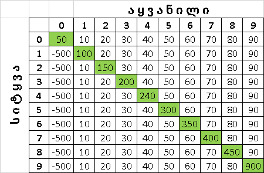

**ჯოკერი** 

მოთამაშეების რაოდენობა - 4

სულ რაუნდების რაოდენობა - 16. 4 რაუნდი შეადგენს 1 ოთხეულს.

კარტების რაოდენობა - 36 (ჯოკერი - 2, 'A' - 4, 'K' - 4, 'Q' - 4, 
'J' - 4, '10' - 4, '9' - 4, '8' - 4, '7' - 4, '6' - 2(გული, აგური) )

_____________________
**თამაშის თანმიმდევრობა:**
1) მოთამაშეებს შეყავთ სახელები
2) შემთხვევითობის პრინციპით ირჩევა ბოლო მოთამაშე და შესაბამისად
განისაზღვრება მიმდევრობა.
3) ყველა მოთამაშეს ურიგდება 9 კარტი. კარტს არიგებს ბოლო მონამაშე, ხოლო შემდეგ კარტი რიგდება რიგის მიხედვით
4) პირველ მოთამაშეს ეხსნება 3 კარტი
5) პირველი მოთამაშე ირჩევს კოზირს ან უკოზირო თამაშს
6) პირველ მოთამაშეს ეხსნება ყველა კარტი და ის ამბობს სიტყვას
7) დანარჩენ მოთამაშეებს ეხსნებათ კარტები და ამბობენ რიგის მიხედვით სიტყვას
ბოლო მოთამაშე ვერ იტყვის ისეთ სიტყვას, რომ სიტყვების ჯამმა შეადგინოს 9
9) პირველი მოთამაშე იწყებს რაუნდს. მას შეუძლია ჩამოვიდეს ნებისმიერი კარტი
10) ყოველი შემდეგი მოთამაშე ვალდებულია, რომ ჩამოვიდეს პირველად
 ჩამოსული კარტის ფერის კარტი (ასეთის არსებობის შემთხვევაში) ან
 ჩამოვიდეს კოზირი (თუ გათამაშება არ არის უკოზირო) ან ჯოკერი. თუ 
პირველი კარტი ჯოკერია, მოთამაშეებს შეუძლიათ ჩამოვიდნენ ნებისმიერი კარტი. 
10) როდესაც ყველა მოთამაშე ჩამოვა კარტს, დგინდება უმაღლესი კარტი და ერთ-ერთ
მოთამაშეს მიაქვს კარტი (4 კარტი)
11) წინა რაუნდის გამარჯვებული ჩამოდის კარტს
12) როდესაც კარტები ამოიწურება, პროგრამა ითვლის ვინ რამდენი 
წაიღო (4 კარტი = 1 წაღება), ვინ შეასრულა სიტყვა და თვლის ქულებს
14) 4 რაუნდის შემდეგ ითვლება, თუ რომელმა მოთამაშემ დაიმსახურა პრემია
პრემიას იმსახურებენ მოთამაშეები, რომლებმაც ოთხეულში შეასრულეს ყველა სიტყვა. 
მათ ემატებათ ოთხეულში მიღებული ქულებიდან ყველაზე მაღალი. 
15) სულ მოთამაშეებმა უნდა ითამაშონ 4 ოთხეული
16) ოთხი ოთხეულის შემდეგ ვლინდება გამარჯვებული.
______________________

 **კარტის სიმაღლის დადგენა:**

1) ერთი ფერის კარტებში, ყველაზე მაღალია მაღალი მნიშვნელობის კარტი.
2) კოზირს შეუძლია ნებისმიერი კარტის გაჭრა, ფერს არ აქვს მნიშვნელობა.
 კოზირზე მაღალი მხოლოდ სხვა კოზირია, რომელსაც აქვს უფრო მაღალი
 მნიშვნელობა. 
3) ჯოკერი არის ყველაზე მაღალი კარტი თამაშში და შეუძლია ნებისმიერი კარტის
 გაჭრა, მათ შორის ჯოკრის გაჭრაც.
 
------------------------------------
**ქულების დათვლა:**

ქულები ითვლება მოცემული ცხრილის მეშვეობით: 

